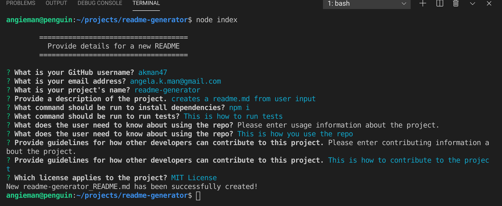

# README Generator

## Description
A Node application that dynamically generates a professional README.md from user input collected via the command line

__Information included in the README.md:__
* Description
* Table of Contents
* Installation
* Usage
* License
* Contribution Guidelines
* How to Test
* Questions

## User Story
As a developer, I want a README generator so that I can quickly create a professionl README for a new project

## Made with
* Node.js
* JavaScript

## Snapshot

## Screen Recording

* [Walkthrough Link](https://drive.google.com/file/d/1tvzBWIoYj48riIXYsya99uX4pF3lbWiD/view)

## Usage
1. Clone readme generator repository
2. Run <code>npm install</code> to install dependencies
3. Run <code>node index</code> to run the app
4. Answer prompts and check out your new README file!

## Packages
* Inquirer

## Criteria
* GIVEN a command-line application that accepts user input
* WHEN I am prompted for information about my application repository
THEN a high-quality, professional README.md is generated with the title of my project and sections entitled Description, Table of Contents, Installation, Usage, License, Contributing, Tests, and Questions
* WHEN I enter my project title
THEN this is displayed as the title of the README
* WHEN I enter a description, installation instructions, usage information, contribution guidelines, and test instructions
THEN this information is added to the sections of the README entitled Description, Installation, Usage, Contributing, and Tests
* WHEN I choose a license for my application from a list of options
THEN a badge for that license is added near the top of the README and a notice is added to the section of the README entitled License that explains which license the application is covered under
* WHEN I enter my GitHub username
THEN this is added to the section of the README entitled Questions, with a link to my GitHub profile
* WHEN I enter my email address
THEN this is added to the section of the README entitled Questions, with instructions on how to reach me with additional questions
* WHEN I click on the links in the Table of Contents
THEN I am taken to the corresponding section of the README

## Contribution
Made by Angela Man